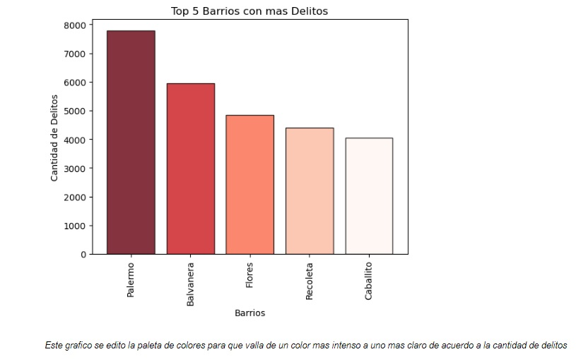
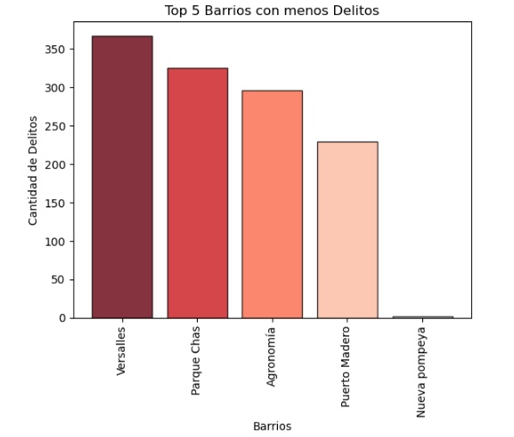
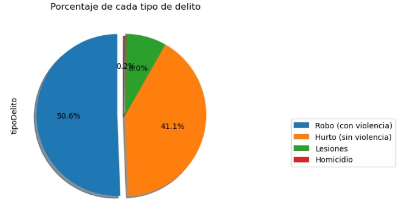

# Análisis del dataset de delitos en la Ciudad de Buenos Aires (2021)
Este proyecto es un notebook Jupyter que analiza el dataset de delitos cometidos en la Ciudad de Buenos Aires durante el año 2021. En el análisis se utilizó Python, junto con las librerías Pandas, Matplotlib y Mapbox, para realizar las visualizaciones y gráficos necesarios, así como también para el proceso de ETL (Extracción, Transformación y Carga) de los datos.

## Instalación y uso
Para utilizar este notebook, puedes hacerlo de dos maneras:

### 1. En Jupyter Notebook:
Para visualizar el notebook en Jupyter Notebook, es necesario tener instalado Jupyter Notebook en tu computadora. Puedes descargarlo desde la página oficial de Jupyter.

Una vez que tengas instalado Jupyter Notebook, puedes clonar este repositorio en tu computadora utilizando el siguiente comando:

git clone https://github.com/javibautistam/DelitosCABA2021.git

Luego, puedes abrir el archivo "Proyecto_Integrador.ipynb" en Jupyter Notebook y ejecutar cada celda para ver los resultados.

### 2. En Google Colab:
Si no tienes instalado Jupyter Notebook en tu computadora, puedes visualizar el notebook en Google Colab. Para hacerlo, sigue los siguientes pasos:

- Abre Google Colab en tu navegador: https://colab.research.google.com
- Haz clic en "Archivo" en la barra de menú y selecciona "Abrir notebook".
- Selecciona la pestaña "GitHub" y pega la URL de este repositorio en el campo de búsqueda.
- Selecciona el archivo "Proyecto_Integrador.ipynb" y haz clic en "Abrir".
- Ejecuta cada celda para ver los resultados.

## Visualizaciones
Este proyecto incluye las siguientes visualizaciones:

- Un gráfico de barras que muestra el top 5 de los barrios con mas delitos.
- Un gráfico de barras que muestra el top 5 de los barrios "mas seguros".
- Un gráfico de barras que muestra el top 5 de los barrios con mas homicidios.
- Un gráfico de torta que muestra los porcentajes de la frecuencia por tipo de delito.
- Un gráfico de torta que muestra los porcentajes de la frecuencia de uso de armas.
- Un mapa que muestra la distribución geográfica de los delitos en la Ciudad de Buenos Aires en 2021.
- 
Aquí se muestran algunas capturas de pantalla de las visualizaciones generadas:
### Gráfico de barras del top 5 de los barrios con mas delitos

### Gráfico de barras del top 5 de los barrios mas seguros

### Gráfico de torta por tipo de delito

### Mapa del delito

## Dataset
El dataset utilizado en este análisis es el "Registro de Delitos" publicado por el Gobierno de la Ciudad de Buenos Aires en su portal de datos abiertos. Los datos corresponden al período comprendido entre el 1 de enero de 2021 y el 31 de diciembre de 2021.

Puedes descargar el dataset original desde la siguiente URL: https://data.buenosaires.gob.ar/dataset/delitos

## Resultados
El análisis incluye gráficos que muestran la cantidad de delitos cometidos por día, por mes y por tipo de delito. También se incluye un mapa interactivo que muestra la distribución geográfica de los delitos en la Ciudad de Buenos Aires durante el año 2021.

## Habilidades técnicas utilizadas
Este proyecto utilizó las siguientes habilidades técnicas:

- Python: Lenguaje de programación utilizado para realizar el análisis de datos.
- Pandas: Biblioteca de Python utilizada para manipular las tablas de datos y realizar el proceso de ETL (Extracción, Transformación y Carga) de los datos.
- Matplotlib: Biblioteca de Python utilizada para crear visualizaciones gráficas de los datos.
- Mapbox: Biblioteca de Python utilizada para crear un mapa interactivo que muestra la distribución geográfica de los delitos en la Ciudad de Buenos Aires durante el año 2021.

## Valor agregado del proyecto
Este análisis de datos de delitos en la Ciudad de Buenos Aires puede ser útil para distintos tipos de usuarios. Algunos ejemplos son:

- Las autoridades gubernamentales pueden utilizar este análisis para detectar patrones en la comisión de delitos y tomar medidas para prevenirlos en el futuro.
- Los ciudadanos pueden utilizar este análisis para tomar precauciones en ciertas áreas o en ciertos momentos.
- Los periodistas y los investigadores pueden utilizar este análisis para investigar tendencias y patrones en la comisión de delitos en la ciudad.
- Los desarrolladores y científicos de datos pueden utilizar este proyecto como ejemplo para aprender cómo realizar análisis de datos utilizando las herramientas y técnicas mencionadas en el README.

## Contribuciones
Si deseas contribuir a este proyecto, puedes hacer un fork del repositorio y enviar tus sugerencias a través de un pull request.

## Licencia
Este proyecto está bajo la Licencia MIT. Para obtener más información, consulta el archivo LICENSE.md.
